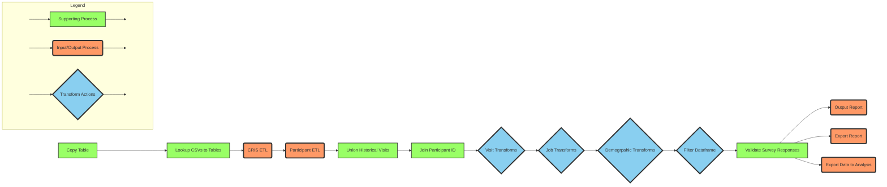

# CIS Households

This repository contains the data engineering pipeline for the Office for National Statistics [COVID-19 and Respiratory Infections Survey (CRIS)](https://www.ons.gov.uk/surveys/informationforhouseholdsandindividuals/householdandindividualsurveys/covid19andrespiratoryinfectionssurveycris/aboutthestudy).

This pipeline was developed and used in production for the predecessor survey to CRIS, the [Coronavirus (COVID-19) Infection Survey (CIS)](https://www.ons.gov.uk/peoplepopulationandcommunity/healthandsocialcare/conditionsanddiseases/bulletins/coronaviruscovid19infectionsurveypilot/previousReleases), and is in the process of being upated for CRIS.

**Please note that this project is open for external reuse and review but closed for contribution.**

## Workflow

The following diagram provides a high level overview of the pipeline for CRIS.

## Directories and files of note

The heirarchy of folders (packages and subpackages) generaly reflects how specific and abstract the code is. Code that is lower-level in abstraction and is more project-specific will sit deeper in the heirarchy.

Modules in the package are named semantically, so describe the types of operations that their contents perform.

Descriptions of project directories and other significant files:
* `cishouseholds/` - the core package in project. Code that is not project specific sits in the modules directly under this directory (i.e. data engineering functions and spark/hdf utilities that could be used in other projects)
    * `cishouseholds/pipeline` - code that is specific to the project sits within this sub-package
        * `cishouseholds/pipeline/run.py` - the pipeline entry-point, which is executed to run the pipeline
        * `cishouseholds/pipeline/pipeline_stages.py` - contains the definitions of most pipeline stages (exept for input file processing stage; see `cishouseholds/pipeline/input_file_stages.py`), which are the highest level groups of logic in the form of an ETL process
        * `cishouseholds/pipeline/input_file_stages.py` - pipeline stages for processing input data files are configured here, using a reusable function factory
        * `cishouseholds/pipeline/pre_union_transformations.py` - functions containing the transformation logic of the pre-union pipeline stages. These exist to allow us to integration test the transformations independents of the extract and load parts of the stages. Usually includes calls to multiple low-level functions
        * `cishouseholds/pipeline/lookup_and_regex_transformations.py` - functions containing the transformation logic of the lookup and regex based pipeline stages. These exist to allow us to integration test the transformations independents of the extract and load parts of the stages. Usually includes calls to multiple low-level functions
        * `cishouseholds/pipeline/post_union_transformations.py` - functions containing the transformation logic of the post-union pipeline stages. These exist to allow us to integration test the transformations independents of the extract and load parts of the stages. Usually includes calls to multiple low-level functions
        * `cishouseholds/pipeline/manifest.py` - a class used to generate a manifest file to trigger automated export of data produced by the pipeline
* `docs/` - package documentation that is built and hosted as HTML by Github Actions based on the `main` branch code. See [documentation for sphinx for updating or building docs manually](https://www.sphinx-doc.org/en/master/)
* `dummy_data_generation/` - dummy data schemata and functions to generate datesets. Used in regression tests for input processing functions
* `tests/` - tests for the code under `cishouseholds/`. Roughly follows the structure of the package, but has become out of date during refactors over time. Searching for references to the current function name is the most reliable way to identify associated tests
    * `tests/conftest.py` - reusable functions and pytest fixtures that can be accessed by any pytest tests
* `CONTRIBUTING.md` - general guidance for contributing to the project
* `Jenkinsfile` - config for Jenkins pipeline that detects new version tags (git tags) and deploys the built package to Artifactory
* `.github/workflows` - configs for Github Actions
